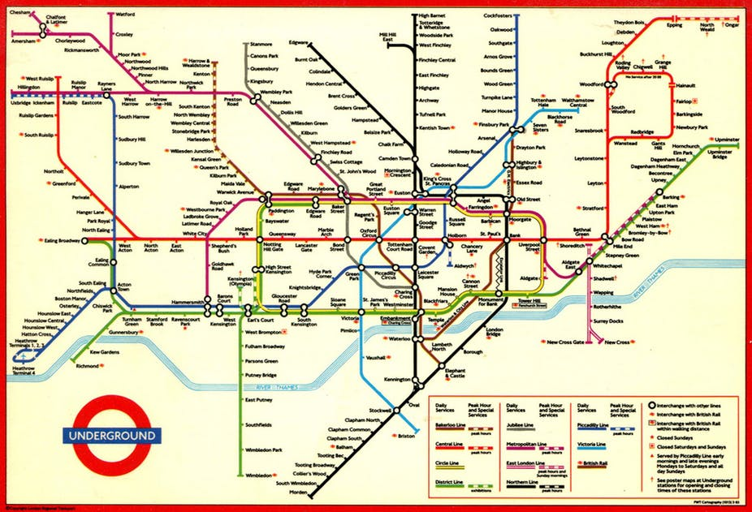
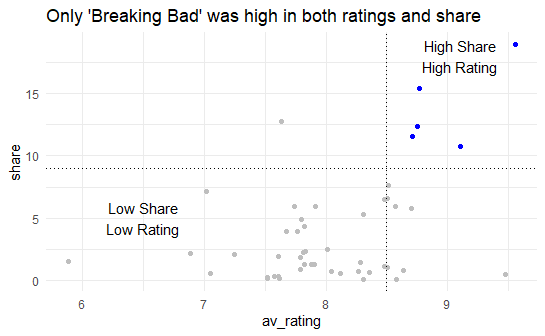
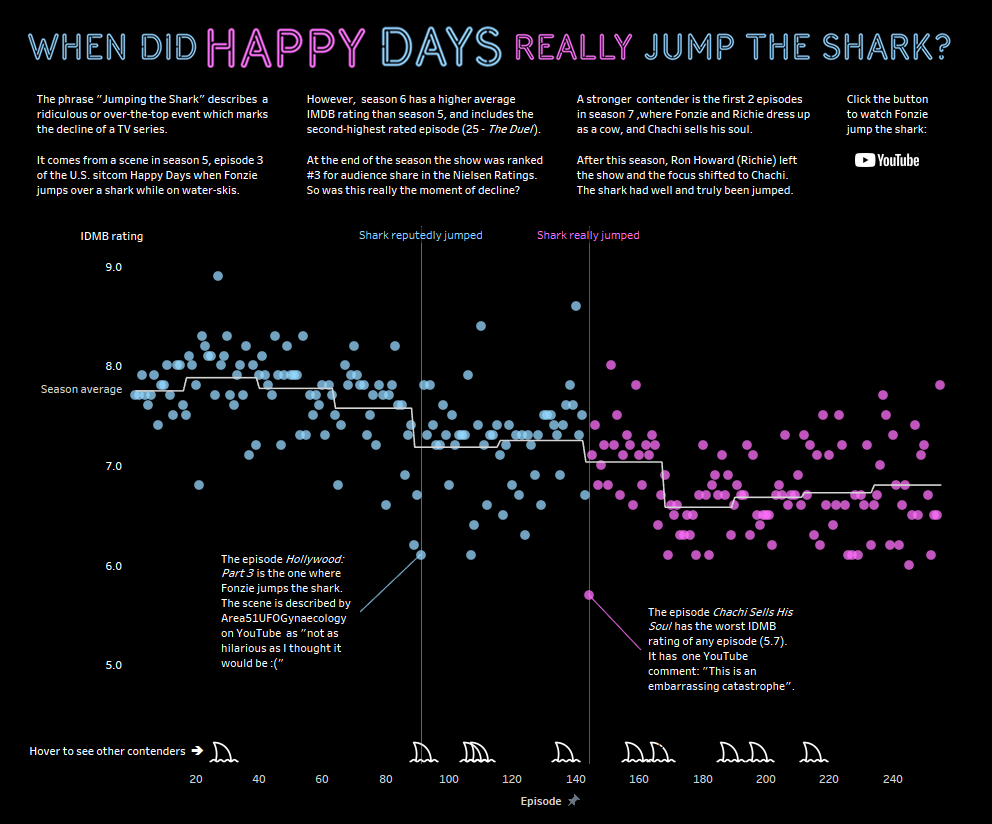

```{r setup, include=FALSE}
options(htmltools.dir.version = FALSE)
library(here)
```

```{r xaringan-themer, include = FALSE}
library(xaringanthemer)
mono_light(
  base_color = "#1c5253",
  header_font_google = google_font("Josefin Sans"),
  text_font_google   = google_font("Montserrat", "300", "300i"),
  code_font_google   = google_font("Droid Mono"),
  text_font_size = "25px"
)
```

# Overview

- Part 1: Getting Started
- Part 2: Decluttering
- Part 3: Annotating
- Part 4: Highlighting
---

# Reminder

This workshop adheres to the BioData Club Code of Conduct:

https://biodata-club.github.io/code_of_conduct 

Please be respectful of your fellow learners and help each other learn.

Remember, it's dangerous to learn alone!
---
# Motivation: Exploratory versus Explanatory

.pull-left[
**Exploratory analysis**: 
  - exploring and understanding the data, conducting the analysis
]
.pull-right[
**Explanatory analysis**: 
  - explaining your findings from your analysis in a coherent narrative that leads to a call to action
]
---
# Effective Visual Communication

Focus on three techniques:

- Decluttering your plot
- Annotating your graph and data
- Highlight data using Preattentive Attributes

---
# Paper Doll Approach

.pull-left[
- We're going to take a basic plot and dress it up
- Modify its appearance to make our point more understandable and immediate
]

.pull-right[
```{r echo=FALSE}

```
]
---

class: center, middle
# Let's open 01-starting-out.Rmd

---
class: center, middle
# Part 2: Declutter your graph

---
# Why do we need to declutter our graphs?

- Reduce cognitive load (help tired and cranky viewers)
- Viewer can focus on what matters
- Not all information is useful for your viewer

---
# Example: London Subway Diagram

.pull-left[
```{r echo = FALSE}

```
]

.pull-right[
- Triumph of minimal design
- Removes geography
- Emphasizes: what lines to I take to get from A to B?
]

.footnote[http://theconversation.com/sublime-design-the-london-underground-map-26240]

---
# Cognitive Load

- Think of your audience: 
    - Tired and cranky and want you to get to the point!
- Remove elements that distract from your message

---
# Ask Yourself

- Does this element support the point I want to make about the data?
- A great example: http://www.storytellingwithdata.com/blog/2017/3/29/declutter-this-graph

---
class: center, middle
# Let's open up 02-decluttering.Rmd

---
class: center, middle
# Part 3: Annotating Your Graphs

---
# Guiding Your Viewer 

Another way we can guide people through our visualization is by using **annotations**, which can be very helpful in guiding someone through our figure. Let's review some best practices.

---
# Use your titles/captions!

- Titles can guide people to the point of your figure
- Primes people to know what to look for
- "If there is a conclusion you want your audience to reach, state it in words" - Cole Nussbaum Knaflic
---
# Don't label everything

.pull-left[- Think about only labeling the data that matters
- If you want someone to compare two shows, label them
- Think about groupings and "super categories" to help your viewers make sense of the graph]

.pull-right[
```{r echo=FALSE}

```
]
---
class: center, middle
```{r echo=FALSE, fig.height=5}
knitr::include_graphics("image/Colin.png")
```

https://datawoj.co.uk/visualising-data-on-which-social-media-network-us-teenagers-prefer/
---
class: center, middle
# Let's open 03-annotating.Rmd

---
class: center, middle
# Part 4: Highlighting Data 

---
# Preattentive attributes

.pull-left[
Color and contrast are known as `preattentive attributes`. Our unconscious brain is aware of these kinds of attributes even before we consciously process the content of a graph.

You can use color and contrast to highlight aspects of the data. Take a look at the following image. How many 3s are there in this image? How hard would it be if the 3s weren't distinct from the other digits?
]

.pull-right[
```{r echo=FALSE}
knitr::include_graphics("image/threes.png")
```
]
---
# Best Practices for Using Color (Stephen Few)

- Use color only when needed to serve a particular communication goal
- Use different colors only when they correspond to differences of meaning in the data.
- Use soft, natural colors to display most information and bright and/or dark colors to highlight information that requires greater attention.
- When using color to encode a sequential range of quantitative values, stick with a single hue (or a small set of closely related hues) and vary intensity from pale colors for low values to increasingly darker and brighter colors for high values.
- To guarantee that most people who are colorblind can distinguish groups of data that are color coded, avoid using a combination of red and green in the same display. 

.footnote[[Practical Rules for Using Color](http://www.perceptualedge.com/articles/visual_business_intelligence/rules_for_using_color.pdf)]

---
class: center, middle
# Let's open up 04-highlighting.Rmd

---
# Conclusions

Congrats! You're well on your way to learning how to make your figures more accessible.

---
class: center, middle
# Putting it all Together

---
class: center, middle

https://t.co/KSGQzaH0Mh
```{r echo=FALSE}

```
---
# `ggplot2` flipbook

Good examples for styling your plots!

https://evamaerey.github.io/ggplot_flipbook/ggplot_flipbook_xaringan.html

- [Arctic Ice](https://evamaerey.github.io/ggplot_flipbook/ggplot_flipbook_xaringan.html#226)
- [Flipping Seats](https://evamaerey.github.io/ggplot_flipbook/ggplot_flipbook_xaringan.html#302)
- [Milk Cows](https://evamaerey.github.io/ggplot_flipbook/ggplot_flipbook_xaringan.html#354)

---
# References

- [Allison Sliter: Data Presentation for Everyone](https://ww2.amstat.org/meetings/sdss/2019/onlineprogram/AbstractDetails.cfm?AbstractID=306642)
- [`ggplot2` flipbook](https://evamaerey.github.io/ggplot_flipbook/ggplot_flipbook_xaringan.html)
- [Alison Hill: Take a Sad Plot and Make it Better](https://alison.rbind.io/talk/2018-ohsu-sad-plot-better/)
- [Storytelling with Data](http://www.storytellingwithdata.com/books)
- Slides are done with xaringan/xaringanthemer

